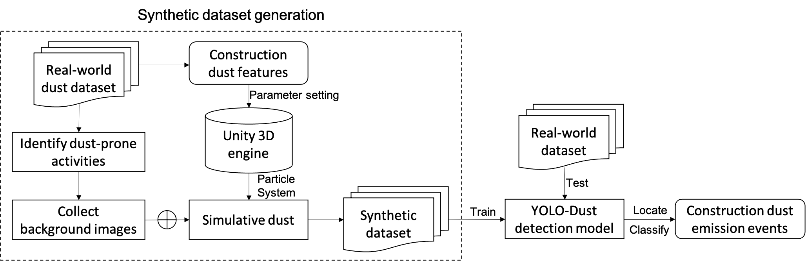
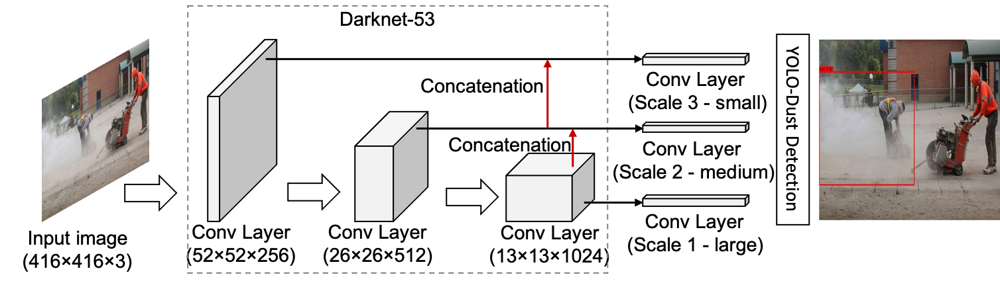
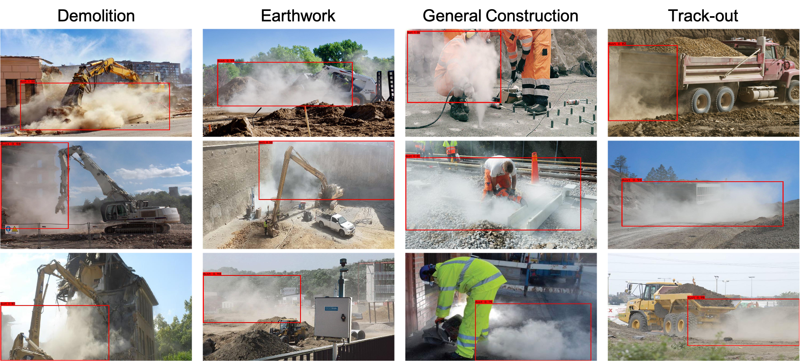

# site-dust-detect

Examine an image-based dust emission monitoring method for construction activities.

## **Table of Contents**

1. [Introduction](#Introduction)
2. [Implementation](#Implementation)
3. [Construction Dust Emission (CDE) Dataset](#Construction-Dust-Emission-(CDE)-Dataset)

## **Introduction**

Visible dust plumes are evidence of dust emissions. This context inspires us to leverage an abundance of visual information for dust monitoring in large and open workplaces. Particularly, construction dust emissions generated along with construction activities are typically short-term or temporary in duration. The temporary nature of dust emission events makes it costly and laborious to collect and label sufficient data for model training.

Based on common dust features, we use the particle system of the Unity 3D engine to simulate dust clouds. The 3D simulative dust clouds are combined with various background images taken from construction sites to automatically generate the synthetic construction dust emission scenarios. 

     
    The framework of the dust detection

## **Implementation**

### **Synthetic Dataset Generation and Annotation**

We specify some parameters, including rendering color, start lifetime, start speed, emission rate over Time, and domain shape. Other parameters such as start location, start rotation, and scaling are randomly set to enhance the variability of the synthetic images.

     
    Synthetic dust emission images with backgrounds.

## **YOLO-Dust Detection Network**

We use the generated synthetic training set to train a YOLO-v3 achitecture for its efficiency and high detection accuracy. On the synthetic training dataset, the 9 clusters are: (81×163), (108×233), (120×140), (147×187), (177×254), (184×140), (201×182), (250×218), and (262×154).

     
    Overview of the YOLO-Dust detection network

The precise boundaries of dust regions are difficult to define visually for some low-opacity dust. Thus, we define the IoU threshold as 0.3 in this study. Below are several successful detection examples for dust emission events.

     
    Detection results of the YOLO-Dust detection model.

- The pretrained YOLO-Dust model is available from [Google Drive](https://drive.google.com/file/d/1gICkxR5i4Qzt1yH-QsUsUKrUZTJGbm0S/view?usp=sharing).

## **Construction Dust Emission (CDE) Dataset**

Construction Dust Emission (CDE) dataset contains three main splits:

  - Training subset (synthetic images): The training subset contains 3,860 synthetic images based on 253 background images. 10% of the images in the training subset are randomly partitioned into the validation subset. [Google Drive](https://drive.google.com/file/d/1GnJNLsM6CdB1mjtc0x-ApOAFfS6yh8Y6/view?usp=sharing)

  - Testing subset (real-world images): The real-world dataset was collected from both real construction sites and online communities. The testing subset consists of 205 real-world dust-filled images and 528 real-world dust-free images. The negative images (dust-free images) are more than the positive samples (dust-filled images) because dust emission events are a minority in real scenarios. [Google Drive](https://drive.google.com/file/d/1np9BX9u3XioIRMChXB50JufmjC-8xiXK/view?usp=sharing)

  - Background subset: The background images were used to generate synthetic dust samples by randomly inserting simulative dust. The background subset has 253 real-world images with dust-prone activities. [Google Drive](https://drive.google.com/file/d/1N3Tu0yjL0JPyBPT5QxaZ8WHcTzLZKFTO/view?usp=sharing)

## **Acknowledgements**

We gratefully acknowledge Mr. Bo Zhang for assisting in data preparation and collection.