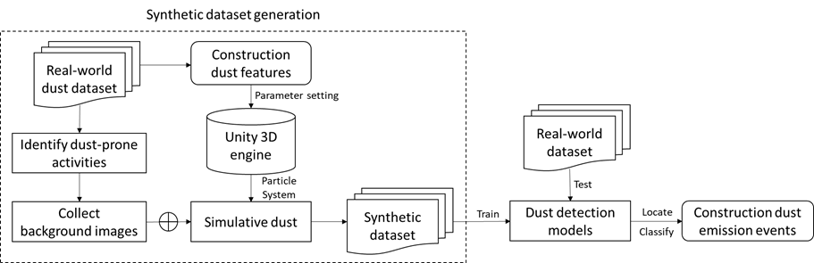
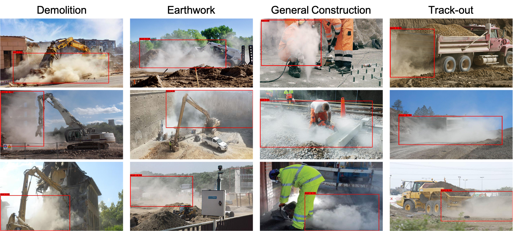

# site-dust-detect

Examine an image-based dust emission monitoring method for construction activities.

## **Table of Contents**

1. [Preparation](#Preparation)

2. [Introduction](#Introduction)

3. [Implementation](#Implementation)

4. [Construction Dust Emission (CDE) Dataset](#Construction-Dust-Emission-(CDE)-Dataset)


## **Preparation**

- python==3.6
- tensorflow-gpu==1.13.2
- keras==2.1.5

Install the requirements (you can use pip or Anaconda):

```
conda create -n tf-keras python=3.6
activate tf-keras
pip install -r ./requirements.txt
```
## **Introduction**

Visible dust plumes are evidence of dust emissions. This context inspires us to leverage an abundance of visual information for dust monitoring in large and open workplaces. Based on common dust features, we use the particle system of the Unity 3D engine to simulate dust clouds. The 3D simulative dust clouds are combined with various background images taken from construction sites to automatically generate the synthetic construction dust emission scenarios. 

<div align="center">
    <br>
    <sup>The framework of the dust detection
</div>

## **Implementation**

### **Synthetic Dataset Generation and Annotation**

We specify some parameters, including rendering color, start lifetime, start speed, emission rate over Time. Other parameters such as start location, start rotation, and scaling are randomly set to enhance the variability of the synthetic images.

<div align="center">
    <br>
    <sup>Synthetic dust emission images with backgrounds.
</div>

## **Dust Detection Networks**

This study trained three state-of-the-art neural networks using open-source implementations.

- Faster R-CNN
- SSD
- YOLO-v3


The precise boundaries of dust regions are difficult to define visually for some low-opacity dust. Thus, we define the IoU threshold as 0.3. Below are several successful detection examples for dust emission events.

<div align="center">
    <br>
    <sup>Detection results of the YOLO-Dust detection model.
</div>

- The pretrained Faster R-CNN model is available from [Google Drive](https://drive.google.com/drive/folders/11W7F__15-9duoC-elkoQ9q2Kwy39CNT4?usp=sharing).
- The pretrained SSD model is available from [Google Drive](https://drive.google.com/drive/folders/1wDbHsUFRwhF-0v1d7hujM9ba0u4WCHxj?usp=sharing).
- The pretrained YOLO-v3 model is available from [Google Drive](https://drive.google.com/drive/folders/1XHbLfIGIGKYPBxbXJys6dwdylPtygmeh?usp=sharing).

## **Construction Dust Emission (CDE) Dataset**

Construction Dust Emission (CDE) dataset contains three main splits:

  - Training subset (synthetic images): The training subset contains 3,860 synthetic images. 10% of the images in the training subset are randomly partitioned into the validation subset. [Google Drive](https://drive.google.com/file/d/1GnJNLsM6CdB1mjtc0x-ApOAFfS6yh8Y6/view?usp=sharing)
  - Testing subset (real-world images): The testing subset consists of 234 dust-filled images and 528 dust-free images. The negative images (dust-free images) are more than the positive samples (dust-filled images) because dust emission events are a minority in real scenarios. [Google Drive](https://drive.google.com/drive/folders/13oCoBSoPqSNXbLVYwfQAbfK4g3YzNrsJ?usp=sharing)
  - Background subset: The background images were used to generate synthetic dust samples by randomly inserting simulative dust. The background subset has 253 real-world images with dust-prone activities. [Google Drive](https://drive.google.com/drive/folders/13oCoBSoPqSNXbLVYwfQAbfK4g3YzNrsJ?usp=sharing)

## **Citation**

If you find this project useful in your research, please consider cite:

```
@article{xiong2021machine,
  title={Machine learning using synthetic images for detecting dust emissions on construction sites},
  author={Xiong, Ruoxin and Tang, Pingbo},
  journal={Smart and Sustainable Built Environment},
  year={2021},
  doi={https://doi.org/10.1108/SASBE-04-2021-0066}
}
```

## **Acknowledgements**

We gratefully acknowledge Mr. Bo Zhang for assisting in data preparation and collection.
